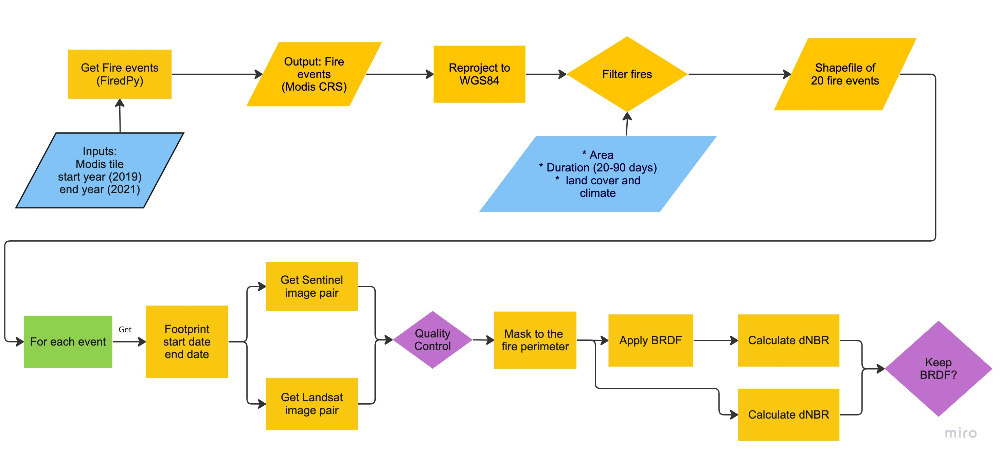
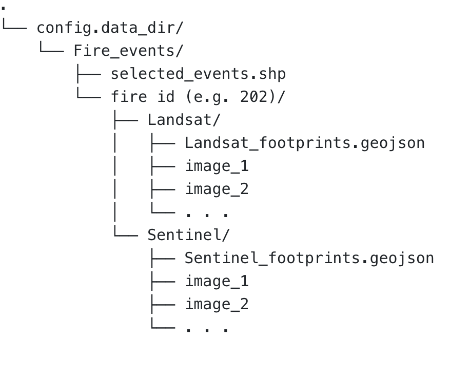

# FIREDpy-NRT

    

Project funded by NASA Applied Sciences Program and developed by ESOC and Earth Lab, CIRES - CU Boulder

## Signal evaluation first stage (Summer 2023)
### Done by [Behzad Vahedi](mailto:behzad@colorado.edu)

Our project aims to extend EarthLab’s "Fire Event Delineation for Python (FIREDpy)" library by updating it for Near-Real-Time (NRT) fire event perimeter mapping through the fusion of optical and radar remote sensing data. Our main motivations are to achieve closer-to-real-time temporal resolution and improve the FIREDpy outputs' spatial resolution. 

In the first stage of the project, we focused on answering two questions:
- __Q1.__ Is applying BRDF correction necessary to generate NRT fire perimeters?
- __Q2.__ How does fire affect the signal in Sentinel-2 and Landsat-8 images, and how do these satellites compare?

Below, I will explain how I approached each question. To run the scripts in this repository, you should create a conda environment using the `environment.yml` file. Follow the instructions provided [here](https://conda.io/projects/conda/en/latest/user-guide/tasks/manage-environments.html#creating-an-environment-from-an-environment-yml-file) to do so.

### Q1. BERDF Correction
The flowchart below demonstrates the steps I took to answer the first question, with the caveat that I only tested BRDF on Sentinel-2 images (using the Sen2nbar package) since I couldn't find any Python implementation of this correction for Landsat images.

__Now, let's go through the different steps in the flowchart__

The steps in the first row of this flowchart are done using the [FiredPy](https://github.com/earthlab/firedpy) package. This resulted in a shapefile of 20 fire events in the Americas, which you can find in the [fire_events](./fire_events/) folder.

Once the fire events are extracted, you need to __get pre- and post-fire image pairs__ for each event. This is done using the [optical_scenes.py](./scripts/optical_scenes.py) script. This script uses the fire's footprint and its start and end date to search for optical images. It can download the images and/or save their footprints. You can run this script using the command below:

`python optical_scenes.py --event_id "202" --satellite "sentinel"`

or alternatively, 

`python optical_scenes.py -id "202" -s "sentinel"`

In these commands, the value of the `event_id` (or `id`) argument must be the ID of the fire event for which satellite images are to be searched. This comes from the id field of the [fire events shapefile](./fire_events/Fire_events.zip). The value of the `satellite` (or `s`) argument must be the name of the satellite, either "sentinel" or "landsat".

#### Important Note:
Before running the `optical_scenes.py` script, you should create separate accounts for Landsat and Sentinel API and set your username and password in the corresponidng variables in the `config.py` file.

You can set or change the search criteria in the `config.py` file. These parameters are:
- `max_cloud_cover`: Maximum cloud cover percentage. default: 40%.
- `delta_days_landsat`: The number of days to use as a buffer before and after the fire event when searching for Landsat images. default: 70 days.
- `delta_days_sentinel`: The number of days to use as a buffer before and after the fire event when searching for Sentinel-2 images. default: 40 days.
- `download_scenes`: Whether to download images or not. default: False. __CAUTION: depending on the number of the images found, this could take a long time and might reqiure a huge amount of storage__.
- `save_footprints`: Whether to save image footprints or not. default: True.
- `update_json`: deprecated.
- `data_dir`: The directory where the images and/or their footprints will be saved. See below for more information.

I suggest first running the script with the default values for `download_scenes` and `save_footprints`. This will give you the footprints and all the available metadata of all the images that satisfy the search criteria in a geojson format. You can then look at the image footprint and metadata, decide which images you'd like to download, and then rerun the script to download only those images (with `download_scenes=True`). However, if you decide to do so, __you should remember to modify the `get_landsat()` and `get_sentinel()` functions inside `optical_scenes.py` following the instructions provided there__

#### Directory Organization
`data_dir` is the directory where you want the images to be saved. Once you create this directory, extract (unzip) the "Fire_events.zip" there. This will (should) create a new subdirectory called Fire_events. Per each fire id you run the `optical_scenes.py` script for, a new subdirectory will be created within "Fire_events". Also, depending on what the `-s` parameter is, the corresponding subdirectory will be created within the fire_id folder where the footprints and images will be saved.

### Q2. Optical Signal Evaluation
To perform the optical signal evaluation and visualize the results, you can use the Jupyter notebooks provided here: One for Sentinel-2 ([Sentinel Image Analysis.ipynb](./scripts/Sentinel%20Image%20Analysis.ipynb)) images and one for Landsat-8 images ([Landsat Image Analysis.ipynb](./scripts/Landsat%20Image%20Analysis.ipynb)). These notebooks are designed modularly, meaning that the functions used in these notebooks can be used outside the notebooks for further investigation and analysis. They should be self-explanatory given the docstrings and comments provided. If you have any questions, please contact Behzad.

Assuming that you have already downloaded the pre- and post-fire images for that fire in the previous step, to run these notebooks, you should: 
1. Change `fire_id` in cell #3  to the fire ID of your interest
2. Change `image_dir` in cell #4 to the directory where your images are located.
3. Change `fire_events` to reflect the directory where your fire shapefile is saved (assuming you have followed the directory structure explained above).
4. The `MASK_IMAGES` variable in these notebooks determines whether the calculations should be masked to the perimeter of the fire or not. Recommended values: `True` when calculating dNBR or applying BRDF, `False` when you want to create and RGB or false-color composite image.
5. These notebooks assume _exactly one_ image before the fire and _exactly one_ image after the fire. If you have more images, you should modify the notebooks.

You should run the notebooks once per fire event.

